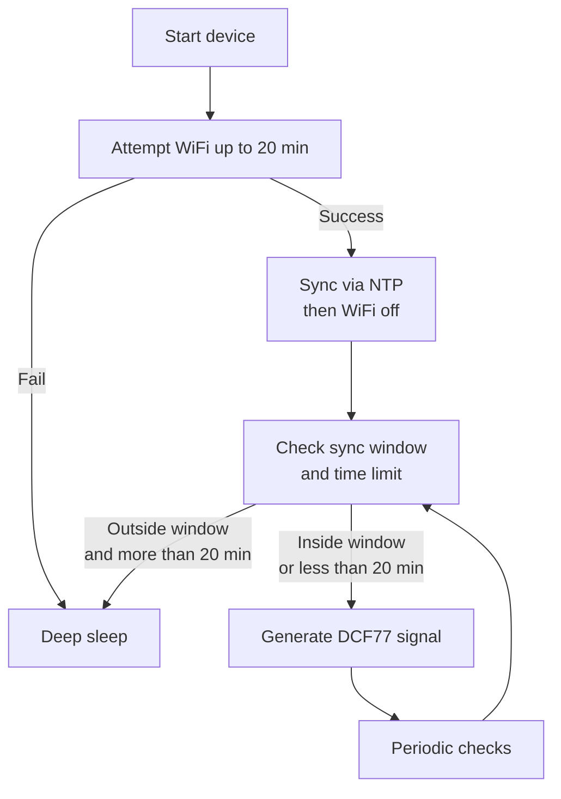

# DCF77 Transmitter for ESP32

This repository contains an **ESP32-based** project that **transmits a DCF77 time signal** only within specified time windows. The code also attempts to connect to multiple WiFi networks for up to **20 minutes** upon startup, synchronizes time with an **NTP server**, and supports **deep sleep** outside the defined sync windows. 

> **Note**: This project’s code was originally adapted (with AI assistance) from Andreas Spiess’s repository [SensorsIot/DCF77-Transmitter-for-ESP32](https://github.com/SensorsIot/DCF77-Transmitter-for-ESP32). I have made modifications for multi-WiFi support, extended the initial active period to 20 minutes, and introduced additional logic for scheduling and deep sleep.

---

## Key Features

1. **Multiple WiFi Networks**  
   - The ESP32 tries each configured SSID in turn, giving up if it fails to connect after 20 minutes in total.

2. **NTP Synchronization**  
   - Once connected, the device updates the system time from a specified NTP server.

3. **DCF77 Signal Generation**  
   - A **PWM** signal at **77.5 kHz** is modulated to emulate the DCF77 pulse pattern.  
   - An LED (on pin 2 by default) indicates pulse states.

4. **Scheduled Sync Windows**  
   - By default, the device remains active only in these windows (each 10 minutes long):
     ```
     00:00-00:10, 01:30–01:40, 02:00–02:10, 03:00–03:10, 
     04:00–04:10, 05:00–05:10, 06:00–06:10, 
     09:30–09:40, 17:30–17:40
     ```
   - Outside these times, the ESP32 goes into deep sleep to save power.

5. **Initial 20-Minute Active Period**  
   - When first powered, the device stays awake for up to **20 minutes** to allow for WiFi configuration and possibly catch a sync window.

6. **Continuous Mode**  
   - If `CONTINUOUSMODE` is defined, the device will not enter deep sleep and will run indefinitely.

---

## Requirements

- **ESP32** development board  
- **Antenna** circuit for DCF77 (antenna pin is driven by PWM on pin 18, through a resistor to GND)  
- **LED** on pin 2 for visual pulse indication (optional)  
- **Arduino IDE** or **PlatformIO** (or another environment supporting ESP32)  

---

## Setup Instructions

1. **Clone or Download**  
   - Retrieve this repository to your local machine.

2. **Open the Project**  
   - Use the Arduino IDE or another preferred environment (like PlatformIO).

3. **Configure `wifi.h`**  
   - Enter your **WiFi SSIDs** and **passwords** in the provided arrays.  
   - Set `ntpServer` and `TZ_INFO` if needed for your region.

4. **Adjust Windows** (Optional)  
   - In `main.cpp`, modify the default `syncWindows[]` array to your preferred DCF77 sync times.

5. **Optional: Continuous Mode**  
   - Uncomment `#define CONTINUOUSMODE` near the top of `main.cpp` if you do not want the device to sleep.

6. **Compile & Upload**  
   - Use the appropriate board settings for ESP32 and flash the code.

7. **Monitor Serial Output**  
   - Open the Serial Monitor at **115200** baud to see debug messages.

---

## High-Level Process (Mermaid Diagram)



### Diagram Explanation

1. **Start device**  
   - The ESP32 powers on (fresh boot or from deep sleep).

2. **Attempt WiFi up to 20 min**  
   - The code loops through multiple WiFi SSIDs, retrying up to 20 minutes total.  
   - If it cannot connect, the device goes to deep sleep immediately.

3. **Sync via NTP then WiFi off**  
   - Once connected, the ESP32 updates the time from an NTP server, then disables WiFi to save power.

4. **Check sync window and time limit**  
   - The board checks if the current local time is within one of the configured 20-minute sync windows and whether it has exceeded the initial 20-minute active window.

5. **Generate DCF77 signal**  
   - If inside a sync window (or still under the 20-minute initial period), it uses the PWM pin to emit DCF77 pulses, toggling an LED if desired.

6. **Deep sleep**  
   - If outside a sync window and beyond the initial 20-minute period, the device enters deep sleep until the next scheduled window.

7. **Periodic checks**  
   - Every 30 seconds, the main loop re-checks the time window to decide whether to keep transmitting or enter deep sleep.

---

## Code Files

1. **`wifi.h`**  
   - Contains arrays of WiFi credentials, the NTP server, and time zone information.

2. **`main.cpp`**  
   - Core logic for WiFi connection (`WiFi_on()`), NTP sync (`getNTP()`), DCF77 signal generation (`CodeTime()`, `DcfOut()`), deep sleep scheduling (`checkSleep()`), and main loops (`setup()`, `loop()`).

---

## License

Unless otherwise stated, this project is made available under the [MIT License](LICENSE) or a similarly permissive license. You are free to copy, modify, and distribute this code.

---

## Original Source & Contribution

- **Original Project**: [SensorsIot/DCF77-Transmitter-for-ESP32](https://github.com/SensorsIot/DCF77-Transmitter-for-ESP32) by Andreas Spiess.  
- **Adapted with AI**: I introduced multi-WiFi capability, extended the active period to 20 minutes, and reorganized the code for clarity.
- **Inspiration**: The idea of performing time synchronization in specific windows was inspired by this article: [https://habr.com/ru/articles/445470/](https://habr.com/ru/articles/445470/)

I welcome pull requests and suggestions. Feel free to open an issue for questions or improvements.