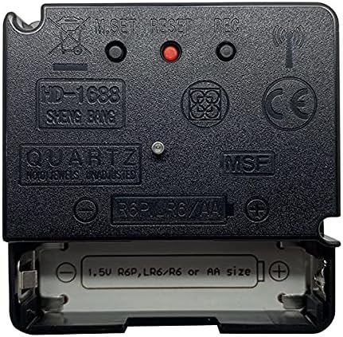
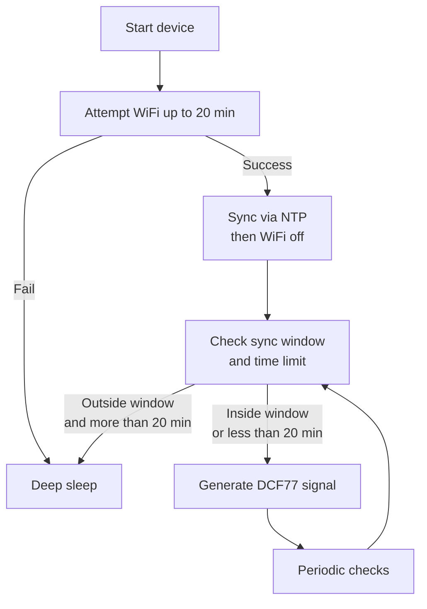

# DCF77 Transmitter for ESP32 and ESPHome Component

This repository contains an **ESP32-based** project that **transmits a DCF77 time signal** in two forms: as an **ESPHome external component** for Home Assistant integration, and as a standalone Arduino sketch with scheduled sync windows and deep sleep. The ESPHome component provides a switch-controlled DCF77 signal generator that can be automated through Home Assistant. The Arduino version connects to multiple WiFi networks for up to **20 minutes** upon startup, synchronizes time with an **NTP server**, and supports **deep sleep** outside defined sync windows.

> **Note**: This project's code was originally adapted (with AI assistance) from Andreas Spiess's repository [SensorsIot/DCF77-Transmitter-for-ESP32](https://github.com/SensorsIot/DCF77-Transmitter-for-ESP32). I have made modifications for multi-WiFi support, extended the initial active period to 20 minutes, introduced additional logic for scheduling and deep sleep, and added an ESPHome external component implementation.

## Compatibility

The DCF77 signal emulation has been successfully tested with **HD-1688** radio-controlled clocks. These affordable clocks reliably synchronize with the signal generated by this project.



## Table of Contents

- [DCF77 Transmitter for ESP32 and ESPHome Component](#dcf77-transmitter-for-esp32-and-esphome-component)
  - [Compatibility](#compatibility)
  - [Table of Contents](#table-of-contents)
  - [Key Features](#key-features)
  - [Using with ESPHome](#using-with-esphome)
    - [Component Setup](#component-setup)
    - [How It Works](#how-it-works)
    - [Requirements for ESPHome](#requirements-for-esphome)
    - [Automation Example](#automation-example)
  - [Arduino Implementation](#arduino-implementation)
    - [Requirements for Arduino](#requirements-for-arduino)
    - [Setup Instructions](#setup-instructions)
    - [High-Level Process (Mermaid Diagram)](#high-level-process-mermaid-diagram)
    - [Diagram Explanation](#diagram-explanation)
  - [Code Files](#code-files)
  - [License](#license)
  - [Original Source \& Contribution](#original-source--contribution)

---

## Key Features

1. **DCF77 Signal Generation**  
   - A **PWM** signal at **77.5 kHz** is modulated to emulate the DCF77 pulse pattern.  
   - An LED (on pin 2 by default) indicates pulse states.

2. **ESPHome Integration**
   - Ready-to-use external component for ESPHome
   - Controllable via Home Assistant switch
   - Automatable based on time or other conditions

3. **Multiple WiFi Networks** (Arduino version)  
   - The ESP32 tries each configured SSID in turn, giving up if it fails to connect after 20 minutes in total.

4. **NTP Synchronization**  
   - The device updates the time from an NTP server for accurate time signals.

5. **Scheduled Sync Windows** (Arduino version)  
   - By default, the device remains active only in these windows (each 10 minutes long):
     ```
     00:00-00:10, 01:30–01:40, 02:00–02:10, 03:00–03:10, 
     04:00–04:10, 05:00–05:10, 06:00–06:10, 
     09:30–09:40, 17:30–17:40
     ```
   - Outside these times, the ESP32 goes into deep sleep to save power.

6. **Initial 20-Minute Active Period** (Arduino version)  
   - When first powered, the device stays awake for up to **20 minutes** to allow for WiFi configuration and possibly catch a sync window.

7. **Continuous Mode** (Arduino version)  
   - If `CONTINUOUSMODE` is defined, the device will not enter deep sleep and will run indefinitely.

---

## Using with ESPHome

This project's primary feature is a ready-to-use ESPHome external component that allows you to integrate the DCF77 signal generator with your Home Assistant setup.

### Component Setup

Add the following to your ESPHome configuration:

```yaml
# Required: NTP time source
time:
  - platform: sntp
    id: sntp_time
    servers:
      - eu.pool.ntp.org  # European NTP server pool
    timezone: Europe/London  # Set your local timezone

# Load the external component from GitHub
external_components:
  - source: github://sst1xx/radio_cron_dcf77@main
    components: [dcf77_emitter]
    refresh: 0h  # Set to a higher value like 24h for production

# DCF77 emitter component configuration
dcf77_emitter:
  time_id: sntp_time  # Reference to the time component
  antenna_pin: GPIO18  # ANTENNAPIN - DCF77 signal output
  led_pin: GPIO2  # LEDBUILTIN - Visual indication of signal (built-in LED on most ESP32 dev boards)
  sync_switch_id: dcf77_sync_switch  # Reference to the control switch

# Switch to control DCF77 signal output
switch:
  - platform: template
    name: "DCF77 Sync"
    id: dcf77_sync_switch
    optimistic: true
    restore_mode: "ALWAYS_OFF"
```

### How It Works

1. **External Component Loading**: The configuration loads the DCF77 emitter component from GitHub.

2. **Signal Generation**: When activated, the component generates a DCF77-compatible signal on pin GPIO18, with visual indication on GPIO2.

3. **Control Switch**: The DCF77 signal is only emitted when the `dcf77_sync_switch` switch is turned ON.
   - You can toggle this switch manually in Home Assistant
   - You can automate the switch based on time or other conditions

4. **Initial State**: The switch defaults to OFF when the device powers up (`restore_mode: "ALWAYS_OFF"`).

### Requirements for ESPHome

- **WiFi Connection**: Required for both SNTP synchronization and Home Assistant integration
- **SNTP Time**: Mandatory for accurate DCF77 signal generation
- **ESP32 Device**: Works best with ESP32 due to precise timing requirements
- **DCF77 Antenna**: 
  - Ferrite rod/core with 50-120 turns of wire
  - One end connects to GPIO18 through a 1kΩ resistor
  - Other end connects to GND
  - The antenna radiates the 77.5 kHz signal for reception by radio clocks

> **Note**: WiFi connection and SNTP time synchronization are mandatory for this component to function properly. The DCF77 signal generation relies on accurate time from the SNTP server to generate the correct time code.

### Automation Example

You could add an automation to turn on DCF77 signal only during specific time windows:

```yaml
automation:
  - id: dcf77_morning_sync
    description: "Enable DCF77 signal at 5 AM for 10 minutes"
    trigger:
      - platform: time
        at: "05:00:00"
    action:
      - switch.turn_on: dcf77_sync_switch
      - delay: 10min
      - switch.turn_off: dcf77_sync_switch
```

---

## Arduino Implementation

This repository also includes a standalone Arduino implementation with scheduled sync windows and deep sleep functionality.

### Requirements for Arduino

- **ESP32** development board  
- **Antenna** circuit for DCF77:  
  - Ferrite rod/core with 50-120 turns of wire wrapped around it
  - One end connects to PIN 18 (ANTENNAPIN) through a 1kΩ resistor
  - Other end connects to GND
  - This creates the magnetic field that radio clocks detect
- **LED** on pin 2 for visual pulse indication (GPIO2 is the built-in LED on most ESP32 dev boards)  
- **Arduino IDE** or **PlatformIO** (or another environment supporting ESP32)

### Setup Instructions

1. **Clone or Download**  
   - Retrieve this repository to your local machine.

2. **Open the Project**  
   - Use the Arduino IDE or another preferred environment (like PlatformIO).

3. **Configure WiFi Settings**
   - **MANDATORY**: Copy `wifi_template.h` to `wifi.h` before compiling: 
     ```bash
     cp wifi_template.h wifi.h
     ```
   - Edit `wifi.h` and set your WiFi credentials, NTP server, and time zone.
   - This file is ignored by git to keep your credentials secure.

4. **Configure `wifi.h` Details**  
   - Enter your **WiFi SSIDs** and **passwords** in the provided arrays.  
   - Set `ntpServer` and `TZ_INFO` if needed for your region.

5. **Adjust Windows** (Optional)  
   - In `main.cpp`, modify the default `syncWindows[]` array to your preferred DCF77 sync times.

6. **Optional: Continuous Mode**  
   - Uncomment `#define CONTINUOUSMODE` near the top of `main.cpp` if you do not want the device to sleep.

7. **Compile & Upload**  
   - Use the appropriate board settings for ESP32 and flash the code.

8. **Monitor Serial Output**  
   - Open the Serial Monitor at **115200** baud to see debug messages.

### High-Level Process (Mermaid Diagram)



### Diagram Explanation

1. **Start device**  
   - The ESP32 powers on (fresh boot or from deep sleep).

2. **Attempt WiFi up to 20 min**  
   - The code loops through multiple WiFi SSIDs, retrying up to 20 minutes total.  
   - If it cannot connect, the device goes to deep sleep immediately.

3. **Sync via NTP then WiFi off**  
   - Once connected, the ESP32 updates the time from an NTP server, then disables WiFi to save power.

4. **Check sync window and time limit**  
   - The board checks if the current local time is within one of the configured 10-minute sync windows and whether it has exceeded the initial 20-minute active window.

5. **Generate DCF77 signal**  
   - If inside a sync window (or still under the 20-minute initial period), it uses the PWM pin to emit DCF77 pulses, toggling an LED if desired.

6. **Deep sleep**  
   - If outside a sync window and beyond the initial 20-minute period, the device enters deep sleep until the next scheduled window.

7. **Periodic checks**  
   - Every 30 seconds, the main loop re-checks the time window to decide whether to keep transmitting or enter deep sleep.

---

## Code Files

1. **ESPHome Component**
   - `components/dcf77_emitter/` - External component files for ESPHome integration

2. **Arduino Implementation**
   - `wifi.h` - Contains arrays of WiFi credentials, the NTP server, and time zone information
   - `radio_cron_dcf77.ino` - Core logic for WiFi connection, NTP sync, DCF77 signal generation, deep sleep scheduling, and main loops

---

## License

Unless otherwise stated, this project is made available under the [MIT License](LICENSE) or a similarly permissive license. You are free to copy, modify, and distribute this code.

---

## Original Source & Contribution

- **Original Project**: [SensorsIot/DCF77-Transmitter-for-ESP32](https://github.com/SensorsIot/DCF77-Transmitter-for-ESP32) by Andreas Spiess.  
- **Adapted with AI**: I introduced multi-WiFi capability, extended the active period to 20 minutes, added ESPHome component implementation, and reorganized the code for clarity.
- **Inspiration**: The idea of performing time synchronization in specific windows was inspired by this article: [https://habr.com/ru/articles/445470/](https://habr.com/ru/articles/445470/)

I welcome pull requests and suggestions. Feel free to open an issue for questions or improvements.